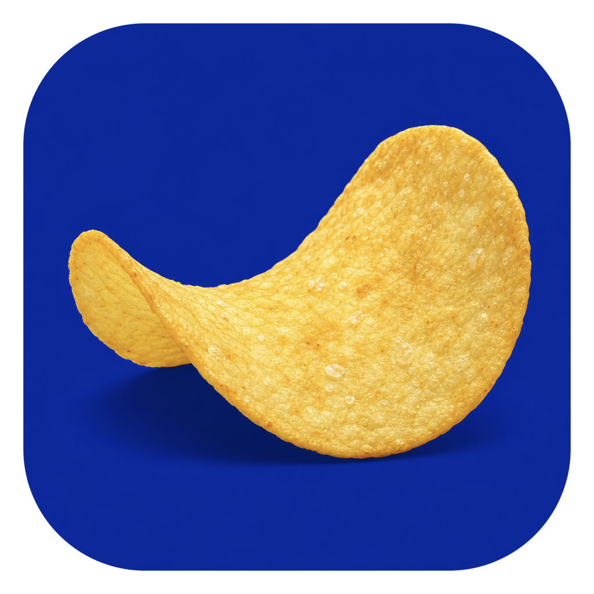

# 薯片手 ChipHand

> 一边吃薯片，一边畅快浏览；不用担心弄脏键盘和触控板。

[](https://github.com/HuYee2025/chiphand-macos/releases)
[](https://github.com/HuYee2025/chiphand-macos/releases/latest)
[](LICENSE)

薯片手是一款原生 macOS 手势控制 App。它使用 Mac 摄像头在本机识别单手动作，让你不碰键盘和触控板，也能翻页、连续滚动、浏览器前进后退，以及移动和点击鼠标。

摄像头画面、手部关键点和模型推理全部留在本机；App 不读取屏幕、不保存视频，也不把识别数据上传到服务器。

<p align="center">
  
</p>

## 下载

- [下载最新版本](https://github.com/HuYee2025/chiphand-macos/releases/latest)
- [下载 macOS 1.0.1 Universal DMG](https://github.com/HuYee2025/chiphand-macos/releases/download/macos-v1.0.1/ChipHand-macOS-1.0.1-universal.dmg)
- [在线安装与手势说明](https://chiphand.huyee.art/)
- [完整图文使用说明](docs/user-guide/index.html)

当前版本为 `1.0.1 build 22`，支持 Apple Silicon 与 Intel Mac，要求 macOS 14 Sonoma 或更高版本。DMG 已内置 App、MediaPipe WASM、手势模型、离线说明和许可证；普通用户不需要安装 Xcode、Node.js、Python 或浏览器插件。

## 安装

1. 下载并打开 `ChipHand-macOS-1.0.1-universal.dmg`。
2. 把“薯片手.app”拖进“Applications / 应用程序”。
3. 首次启动时，如果 macOS 阻止打开，请右键 App 选择“打开”；也可以进入“系统设置 → 隐私与安全性”，点击“仍要打开”。
4. 按 App 提示允许“摄像头”和“辅助功能”。
5. 回到薯片手，点击“开启手势控制”。

免费开源版使用固定身份的 ad-hoc 签名，没有购买 Apple Developer 的 Developer ID，也没有经过 Apple notarization。因此首次安装需要手动放行一次；这是免费分发方式的限制，不代表 App 需要联网。

## 四种核心操作

| 操作 | 手势 | 结果 |
| --- | --- | --- |
| 翻页 | 张开手掌左右挥动 | 右挥向下翻，左挥向上翻 |
| 连续滚动 | 做严格 OK，捏住后上下移动 | 上下滚动；松开或丢手立即停止 |
| 浏览器导航 | 手势呈 OK 状，食指和拇指之间出现黄色点后跨过中线 | 左到右返回，右到左前进；出现白色线条提醒即可松手 |
| 鼠标与点击 | 竖起食指定位，拇指与中指捏合直到出现第 2 个黄色点 | 选中、点击，也可用于播放与暂停控制 |

“严格 OK”指拇指和食指接触，同时中指、无名指、小指保持张开。这样可以避免握拳或普通晃动误触滚动。

浏览器返回/前进和食指鼠标目前只允许 Chrome、Safari、Microsoft Edge 与夸克浏览器；翻页和滚动可作用于当前前台应用。食指指针只映射主屏幕。

## 反馈与控制

- 全屏黄色控制点显示当前真正参与操作的位置。
- 严格 OK 横向跨过中线时，会闪现白色核心、蓝色外发光竖线，表示动作已经触发，可以松手。
- 全屏骨架可关闭；关闭后黄色控制点和跨线反馈仍保留。
- 底部状态条可收进屏幕右边缘，迷你条可上下移动。
- 双击展开状态条可暂停或恢复识别。
- 控制窗口可选择右手或左手；另一只手会被忽略。
- 摄像头校准窗口默认关闭，只在排查识别问题时打开。

## 隐私与权限

薯片手只申请两项系统权限：

- 摄像头：获取实时画面，供本机 MediaPipe Gesture Recognizer 识别手势。
- 辅助功能：向当前前台应用发送滚动、浏览器导航、鼠标移动和左键事件。

薯片手不申请屏幕录制、输入监控或网络访问权限。运行时会在进程内临时监听随机 `127.0.0.1` 端口，只用于把 App 自带的模型和 WASM 资源交给本机 WKWebView；外部设备无法访问。

## 常见问题

### 系统显示权限已开，但 App 仍提示未授权

先完全退出薯片手，在“系统设置 → 隐私与安全性 → 辅助功能”中删除旧条目，再重新打开 `/Applications/薯片手.app` 并授权。不要直接运行下载目录或构建目录中的临时 App。

### 摄像头正常，但手势没有控制页面

先在主窗口点击“测试系统下翻”。如果测试也没有效果，问题在辅助功能权限；如果测试有效，再打开摄像头校准窗口，确认选择的控制手、骨架和手势状态是否正确。

### 食指有黄色点，但鼠标不移动

食指鼠标只支持主屏幕和四个白名单浏览器。还要确认辅助功能已经允许，并且当前识别引擎不是 Apple Vision 备用模式。

更多排障步骤见[完整图文说明](docs/user-guide/index.html)。

## 从源码构建

### 环境

- macOS 14+
- Xcode 26 或兼容的 Swift 6 工具链
- Node.js 24+ 与 npm（只用于准备内置 MediaPipe Web 资源和历史 Web/Extension 工程）

### 运行测试与构建 App

```bash
npm ci
npm run typecheck
npm test

cd macos-app
swift test
swift run GestureControlCoreChecks
./scripts/build-app.sh
open build/ChipHand.app
```

安装到 `/Applications`：

```bash
cd macos-app
./scripts/install-app.sh
```

生成 Universal DMG、ZIP 和 SHA-256：

```bash
cd macos-app
./scripts/package-release.sh
```

产物位于 `macos-app/releases/`。构建脚本会把 `arm64` 与 `x86_64` 合并为 Universal App，并检查 Info.plist、资源完整性和固定 designated requirement。

## 项目结构

```text
macos-app/
  Sources/GestureControlCore/      手势几何与状态机
  Sources/GestureControlApp/       SwiftUI App、权限、识别与系统事件
  Tests/                           Swift 核心测试
  scripts/                         App、安装包与 Release 构建脚本
docs/user-guide/                   可离线打开的普通用户图文说明
src/native-recognizer.ts           WKWebView 内的 MediaPipe 识别运行时
extension/                         已冻结的 Chrome 插件实验
src/                               已冻结的 Web Demo 与插件共用模块
```

详细实现见[架构说明](docs/architecture.md)，版本变化见[CHANGELOG](CHANGELOG.md)。

## 参与贡献

欢迎提交 Bug、兼容性结果和明确的小功能改进。开始前请阅读 [CONTRIBUTING.md](CONTRIBUTING.md)。涉及权限、隐私或系统事件安全的问题，请按 [SECURITY.md](SECURITY.md) 的方式报告。

## 开源许可

项目源码和原创视觉资产使用 [MIT License](LICENSE)。MediaPipe Tasks Vision 使用 Apache License 2.0，详见 [THIRD_PARTY_NOTICES.md](THIRD_PARTY_NOTICES.md) 与 [THIRD_PARTY_LICENSES/Apache-2.0.txt](THIRD_PARTY_LICENSES/Apache-2.0.txt)。
